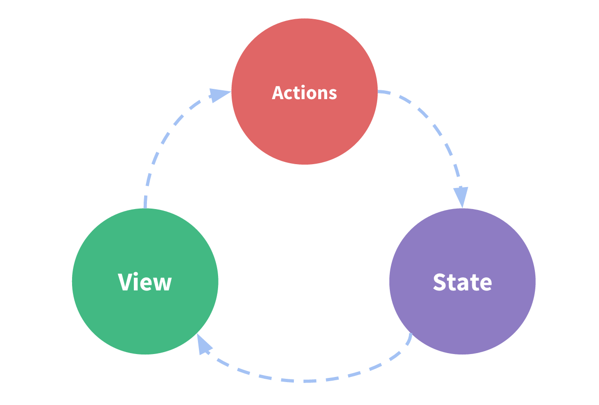
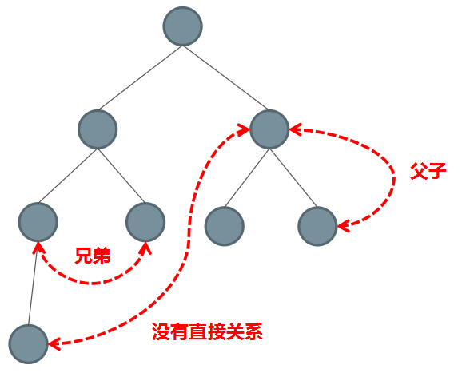
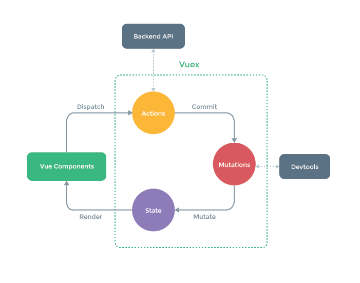
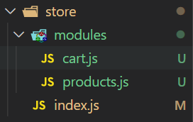

## 课程目标

- Vue 组件间通信方式回顾
- Vuex 核心概念和基本使用回顾
- 购物车案例
- 模拟实现 Vuex

## 组件内的状态管理流程

Vue 最核心的两个功能：数据驱动和组件化

组件化开发给我们带来了：

- 更快的开发效率
- 更好的可维护性

每个组件都有自己的状态、视图和行为等组成部分

```js
new vue({
  // state
  data () {
    return {
      count: ()
    }
  },
  // view
  template: `
    <div>{{ count }}</div>
  `,
  // actions
  methods: {
    increment () {
      this.count++
    }
  }
})
```

状态管理包含以下几部分：

- state，驱动应用的数据源
- view，以声明方式将 state 映射到视图
- actions，响应在 view 上的用户输入导致的状态变化



## 组件间通信方式回顾

大多数场景下的组件都并不是独立存在的，而是相互协作共同构成了一个复杂的业务功能。在 Vue 中为不同的组件关系提供了不同的通信机制。



#### 父传子 Props Down

```js
<blog-post title="My journey with vue"></blog-post>
```

```js
Vue.component("blog-post", {
  props: ["title"],
  template: "<h3>{{ title }}</h3>",
});
```

#### 子传父 Event Up

在子组件中使用 \$emit 发布自定义事件：

```js
<button v-on:click="$emit('enlargeText', 0.1)">Enlarge text</button>
```

在使用这个组件的时候，使用 v-on 监听这个自定义事件

使用事件抛出一个值

```html
<blog-post v-on:enlargeText="hFontSize += $event"></blog-post>
```

#### 非父子组件 Event Bus

我们可以使用一个非常简单的 Event Bus 来解决这个问题：

`eventbus.js`:

```js
export default new Vue();
```

然后再需要通信的两端：
使用 `$on`订阅：

```js
// 没有参数
bus.$on("自定义事件名称", () => {
  // 执行操作
});

// 有参数
bus.$on("自定义事件名称", (data) => {
  // 执行操作
});
```

使用 `$emit`发布：

```js
// 没有自定义传参
bus.$emit("自定义事件名称");

// 有自定义传参
bus.$emit("自定义事件名称", 数据);
```

#### 父直接访问子组件：通过 ref 获取组件

ref 有两个作用：

- 如果你把它们作用到普通 HTML 标签上，则获取到的是 DOM
- 如果你把它们作用到组件标签上，则获取到的是组件实例

创建 base-input 组件

```js
<templage>
  <input ref="input">
</template>

<script>
  export default {
    methods: {
      // 用来从父组件聚焦输入框
      focus: function () {
        this.$refs.input.focus()
      }
    }
  }
<script>
```

在使用子组件的时候，添加 ref 属性：

```html
<base-input ref="username"></base-input>
```

然后在父组件等渲染完毕后使用 `$refs` 访问

```js
mounted () {
  this.$refs.usernameInput.focus()
}
```

> `$refs`只会在组件渲染完成之后生效，并且他们不是响应式的。这仅作为一个用于直接操作子组件的”逃生舱“--你应该避免在模板或计算属性中访问`$refs`.

#### 简易的状态管理方案

如果多个组件之间要共享状态（数据），使用上面的方式虽然可以实现，但是比较麻烦，而且多个组件之间互相传值很难追踪数据的变化，如果出现问题很难定位问题。
当遇到多个组件需要共享状态的时候，典型的场景：购物车。我们如果使用上述的方案都不合适，我们会遇到以下的问题

- 多个视图依赖于同一状态
- 来自不通视图的行为需要变更同一状态

对于问题一，传参的方法对于多层嵌套的组件将会非常繁琐，并且对于兄弟组件间的状态传递无能为力。
对于问题二，我们经常会采用父子组件直接引用或者通过事件来变更和同步状态的多份拷贝。以上的这些模式非常脆弱，通常会导致无法维护的代码。
因此，我们为什么不把组件的共享状态抽取出来，以一个全局单例模式管理呢？在这种模式下，我们的组件树构成了一个巨大的“视图”，不管在树的哪个位置，任何组件都能获取状态或者触发行为！
我们可以把多个组件的状态，或者整个程序的状态放到一个集中的位置存储，并且可以检测到数据的更改。你可能已经想到了 Vuex。

这里我们先以一种简单的方式来实现

- 首先创建一个共享的仓库 store 对象

```js
export default {
  debug: true,
  state: {
    user: {
      name: "xiaoming",
      age: 18,
      sex: "男",
    },
  },
  setUserNameAction(name) {
    if (this.debug) {
      console.log("setUserNameAction triggered: ", name);
    }
    this.state.user.name = name;
  },
};
```

- 把共享的仓库 store 对象，存储到需要共享状态的组件的 data 中

```js
import store from "./store";
export default {
  methods: {
    // 点击按钮的时候通过 action 修改状态
    change() {
      store.setUserNameAction("componentB");
    },
  },
  data() {
    return {
      privateStage: {},
      sharedState: store.state,
    };
  },
};
```

接着我们继续延伸约定，组件不允许直接变更属于 store 对象的 state，而应执行 action 来分发（dispatch）事件通知 store 去改变，这样最终的样子跟 Vuex 的结构就类似了。这样约定的好处是，我们能够记录所有 store 中发生的 state 变更，同时实现能做到记录变更、保存状态快照、历史回滚/时光旅行的先进的调试工具。

## Vuex 回顾

#### 什么是 Vuex

> Vuex 是一个专为 Vue.js 应用程序开发的状态管理模式。采用集中式存储管理应用的组件的状态，并以相应的规则保证状态以一种可预测的方式发生变化。Vuex 也集成到 Vue 的官方调试工具 devtools extension，提供了诸如零配置的 time-travel 调试、状态快照导入导出等高级调试功能。

- Vuex 是专为 Vue.js 设计的状态管理库
- 它采用集中式的方式存储需要共享的数据
- 从使用角度，它就是一个 JavaScript 库
- 它的作用是进行状态管理，解决复杂组件通信、数据共享

#### 什么情况下使用 Vuex

> 官方文档：
> Vuex 可以帮助我们管理共享状态，并附带了更多的概念和框架。这需要对短期和长期效益进行权衡。
> 如果您不打算开发大型单页应用，使用 Vuex 可能是繁琐冗余的。确实是如此--如果您的应用够简单，您最好不要使用 Vuex.一个简单的 store 模式就足够您所需了。但是，如果您需要构建一个中大型单页应用，您很可能考虑如何更好地在组件外部管理状态，Vue 将会成为自然而然的选择。引用 Redux 的作者 Dan Abramov 的话说就是：Flux 架构就像眼镜：您自会知道什么时候需要它。

当你的应用中具有以下需求场景的时候：

- 多个视图依赖于同一个状态
- 来自不同视图的行为需要变更同一状态

建议符合这种场景的业务使用 Vuex 来进行数据管理，例如非常典型的场景：购物车。

**注意：Vuex 不要滥用，不符合以上需要的业务不要使用，反而会让你的应用变得更麻烦。**

#### 核心概念回顾



**基本结构**

- 导入 Vuex
- 注册 Vuex
- 注入 \$store 到 Vue 实例

**State**

Vuex 使用单一状态树，用一个对象就包含了全部的应用层级状态。
使用 mapState 简化 State 在视图中的使用，mapState 返回计算属性
mapState 有两种使用的方式：

- 接收数组参数

```js
// 该方法是 vuex 提供的，所以使用前先导入
import { mapState } from 'vuex'
// mapState 返回名称为 count 和 msg 的计算属性
// 在模板中直接使用 count 和 msg
computed： {
  ...mapState(['count', 'msg'])
}
```

- 接收对象参数

如果当前视图中已经有了 count 和 msg， 如果使用上述方式的话会有命名冲突，解决方式：

```js
// 该方法是 vuex 提供的，所用使用前需要导入
import { mapState } from 'vuex'
// 通过传入对象，可以重命名返回计算的属性
// 在模板中直接使用 num 和 message
computed: {
  ...mapState({
    num: state => state.count,
    message: state => state.msg
  })
}
```

**Getter**
Getter 就是 store 中的计算属性，使用 mapGetter 简化视图中的使用

```js
import { mapGetter } from 'vuex'

computed: {
  ...mapGetter(['reverserMsg']),
  // 改名，在模板中使用 reverse
  ...mapGetter({
    reverse: 'reverseMsg'
  })
}
```

**Mutation**
更改 Vuex 的 store 中的状态的唯一方式是提交 mutation。Vuex 中的 mutation 非常类似于事件：每个 mutation 都一个字符串的 **事件类型（type）**和一个**回调函数（handler）**。这个回调函数就是我们实际进行状态更改的地方，并且它会接收 `state`作为第一个参数。

使用 Mutation 改变状态的好处是，集中的一个位置对状态修改，不管在什么地方修改，都可以追踪到状态的修改。可以实现高级的 time-travel 调试功能

```js
import { mapMutations } from 'vuex'

methods: {
  ...mapMutations(['increate']),
  // 传对象解决重命的问题
  ...mapMutations({
    increateMut: 'increate'
  })
}
```

**Action**

Action 类似于 mutation，不同在于：

- Action 提交的是 mutation，而不是直接变更状态
- Action 可以包含任意异步操作

```js
import { mapActions } from 'vuex'

methods: {
  ...mapActions(['increate']),
  // 传对象解决重名的问题
  ...mapActions({
    increateAction: 'increate'
  })
}
```

**Module**

由于使用单一状态树，应用的所有状态会集中到一个比较大的对象。当应用变得非常复杂时，store 对象就有可能变得相当臃肿。

为了解决以上问题，Vuex 允许我们将 store 分割成**模块（module）**。每个模块拥有自己的 state 、mutation、actions、getter、甚至是嵌套子模块。

在案例中体会 Module 的使用

**购物车案例**

接下来我们通过一个购物车案例来演示 Vuex 在项目中的使用方式，首先把购物车的项目模板下载下来。

[模板地址](https://github.com/goddlts/vuex-cart-demo-template.git)

**功能列表**

- 商品列表组件
- 商品列表中弹出框组件
- 购物车列表组件

**商品列表**

###### 商品列表功能

- Vuex 中创建两个模块，分别用来记录商品列表和购物车的状态，store 的结构：



- products 模块，store/modules/products.js

```js
import axios from 'axios'
const state = {
  products: []
}

const getters = {}

const mutations = {
  setAllProducts (state, products) {
    state.products = products
  }
}

const actions = {
  async getAllProducts ({ commit }) {
    const { data } = await axios({
      method: 'GET’,
      url: 'http://127.0.0.1:3000/products'
    })
    commit('setAllProducts', data)
  }
}

export default {
  namespaced: true,
  state,
  getters,
  mutations,
  actions
}
```

- store/index.js 中注册 products.js 模块
- views/products.vue 中实现商品列表的功能

```js
import { mapState, mapActions } from "vuex";

export default {
  name: "ProductList",
  computed: {
    ...mapState("products", ["products"]),
  },
  methods: {
    ...mapActions("products", ["getAllProducts"]),
  },
  created() {
    this.getAllProducts();
  },
};
```

###### 添加购物车

- cart 模块实现添加购物车功能，store/modules/cart.js

```js
const mutations = {
  addToCart(state, product) {
    // 判断 cartProducts 中是否已有该商品
    // 如果有的话，把 product 添加到数组中，设置 count=1,isChecked=true,totalPrice
    //否则的话找到购物车中的商品让 count + 1

    const prod = state.cartProducts.find((item) => item.id === product.id);
    if (prod) {
      prod.count++;
      prod.isChecked = true;
      prod.totalPrice = prod.price * prod.count;
    } else {
      state.cartProducts.push({
        ...product,
        totalPrice: product.price,
        count: 1,
        isChecked: true,
      });
    }
  },
};
```

- store/index.js 中注册 cart 模块
- view/products.vue 中实现购物车功能

```html
<!-- 修改模板 -->
<template slot-scope="scope">
  <el-button @click="addToCart(scope.row)">加入购物车</el-button>
</template>

<!-- 映射 cart 中的 mutations -->
...mapMutations('cart', ['addToCart']),
```

- 测试，通过 vue-devtools 观察数据的变化

**商品列表-弹出购物车窗口**

###### 购物车列表

- components/pop-cart.vue 中展示购物车列表

```js
import { mapState } from 'vuex'

export default {
  name: 'ProCart',
  computed: {
    ...mapState('cart', ['cartProducts])
  }
}
```

###### 删除

- cart 模块实现从购物车删除的功能，store/modules/cart.js

```js
// mutations 中添加
d
deleteFromCart (state, proId) {
  const index = state.cartProducts.find(item => item.id === prodId)
  index !== -1 && state.cartProducts.splice(index, 1)
}
```

- components/pop-cart.vue 中实现删除功能

```js
<template slot-scope="scope">
  <el-button
    @click="deleteFromCart(scope.row.id)"
    size="mini"
  >删除</el-button>
</template>
```

```js
methods: {
  ...mapMutations('cart', ['deleteFromCart'])
}
```

###### 小计

- cart 模块实现统计总数和总价，store/modules/cart.js

```js
const getters = {
  totalCount(state) {
    return state.cartProducts.reduce((count, prod) => {
      return count + prod.count;
    }, 0);
  },
  totalPrice(state) {
    return state.cartProducts
      .reduce((count, prod) => {
        return count + prod.totalPrice;
      }, 0)
      .toFixed(2);
  },
};
```

- components/pop-cart.vue 中显示徽章和小计

```html
<div>
  <p>共 {{ totalCount }} 件商品 共计¥{{ totalPrice }}</p>
  <el-button size="mini" type="danger" @click="$router.push({name: 'cart'})"
    >去购物车</el-button
  >
</div>
<el-badge :value="totalCount" class="item" slot="reference">
  <el-button type="primary">我的购物车</el-button>
</el-badge>
```

```js
computed: {
  ...mapState('cart', ['cartProducts']),
  ...mapGetters('cart', ['totalCount', 'totalPrice'])
}
```

**购物车**

###### 购物车列表

省略。。。

###### 全选功能

- cart 模块实现更新商品的选中状态，store/modules/cart.js

```js
// 更新所有商品的选中状态（点击全选）
updateAllProductsChecked(state, checked) {
  state.cartProducts.forEach(prod => {
    prod.isChecked = checked
  })
},
// 更新某个商品的选中状态（点击单个商品）
updateProductsChecked (state, {
  prodId,
  checked
}) {
  const prod = state.cartProducts.find(prod => prod.id === prodId)
  prod && (prod.isChecked = checked)
}
```

- views/cart.vue，实现全选功能

  - 使用事件抛出一个值

  ```html
  <el-checkbox
    slot="header"
    slot-scope="scope"
    size="mini"
    v-model="checkedAll"
  >
  </el-checkbox>

  <!-- @change="updateProductChecked" 默认参数：更新后的值 -->
  <!-- @change="updateProductChecked(productId, $event)" 123，原来那个默认参数当你传递了自定义参数的时候，还想得到原来那个默认参数，就手动传递一个 $event -->

  <template slot-scope="scope">
    <el-checkbox
      size="mini"
      :value="scope.row.isChecked"
      @change="upateProductChecked({
        prodId: scope.row.id,
        checked: $event
      })"
    >
    </el-checked>
  </template>
  ```

  ```js
  computed: {
    ...mapState('cart', ['cartProducts']),
    checkedAll: {
      get () {
        return this.cartProducts.every(prod => prod.isChecked)
      },
      set (value) {
        this.updateAllProductsChecked(value)
      }
    }
  },
  methods: {
    ...mapMutations('cart', [
      'updateAllProductsChecked',
      'updateProductsChecked'
    ])
  }
  ```

###### 数字文本框

- cart 模块实现更新商品数量，store/modules/cart.js

```js
updateProductsCount (state, {
  prodId,
  count
}) {
  const prod = state.cartProducts.find(prod => prod.id === prodId)
  if (prod) {
    prod.count = count
    prod.totalProce = prod.price * count
  }
}
```

- views/cart.vue，实现数字文本框功能

```html
<template slot-scope="scope">
  <el-input-number
    size="mini"
    :mini="1"
    controls-position="right"
    :value="scope.row.count"
    @change="updateProductsCount({
      prodId: scope.row.id,
      count: $event
    })"
  >
  </el-input-number>
</template>
```

```js
...mapMutations('cart', [
  'updateAllProductsChecked',
  'updateProductChecked',
  'updateProductCount'
])
```

###### 删除

省略。。。

###### 小计

- cart 模块实现统计选中商品价格和数量，store/modules/cart.js

```js
checkedTotalCount (state) {
  return state.cartProducts.reduce((count, prod) => {
    if (prod.isChecked) {
      count += prod.count
    }
    return count
  },0)
},
checkedTotalPrice (state) {
  return state.cartProducts.reduce((count, prod) => {
    if (prod.isChecked) {
      count += prod.totalPrice
    }
    return count
  },0).toFixed(2)
}
```

- views/cart.vue，实现小计

```html
<p>
  已选 <span>{{ checkedTotalCount }}</span> 件商品，总价：<span
    >{{checkedTotalPrice}}</span
  >
</p>
```

```js
...mapGetters('cart', ['checkedTotalCount', 'checkTotalPrice'])
```

**本地存储**

###### Vuex 插件

**严格模式**

## Vuex 模拟实现

回顾基础实例，自己实现一个 Vuex 实现同样的功能

```js
import Vue from "vue";
import Vuex from "vuex";

Vue.use(Vuex);
export default new Vuex.Store({
  state: {
    count: 0,
    msg: "Hello World",
  },
  getters: {
    reverseMsg(state) {
      return state.msg.split("").reverse().join("");
    },
  },
  mutations: {
    increate(state, payload) {
      state.count += payload.num;
    },
  },
  actions: {
    increate(context, payload) {
      setTimeout(() => {
        context.commit("increate", { num: 5 });
      }, 2000);
    },
  },
});
```

###### 实现思路

- 实现 install 方法

  - Vuex 是 Vue 的一个插件，所以和模拟 VueRouter 类似，先实现 Vue 插件约定的 install 方法

- 实现 Store 类

  - 实现构造函数，接受 options
  - state 的响应化处理
  - getter 的实现
  - commit、dispatch 方法

###### install 方法

```js
let _Vue = null;
function install(Vue) {
  _Vue = Vue;
  _Vue.mixin({
    beforeCreate() {
      if (this.$options.store) {
        Vue.prototype.$store = this.$options.store;
      }
    },
  });
}
```

###### Store 类

```js
class Store {
  constructor(options) {
    const { state = {}, getters = {}, mutations = {}, actions = {} } = options;

    this.state = _Vue.observable(state);

    // 此处不直接 this.getters = getters，是因为下面的代码中要方法 getters 中的 key
    // 如果这么写的话，会导致 this.getters 和 getters 指向同一个对象
    // 当访问 getters 的 key 的时候，实际上就是访问 this.getters 的 key 会触发 key 属性的 getter
    // 会产生死递归
    this.getters = Object.create(null);

    Object.keys(getters).forEach((key) => {
      Object.defineProperty(this.getter, key, {
        get: () => getters[key](this.state),
      });
    });

    this.mutations = mutations;
    this.actions = actions;
  }

  commit(type, payload) {
    this.mutations[type](this.state, payload);
  }

  dispatch(type, payload) {
    this.actions[type](this, payload);
  }
}

// 导出模块
export default {
  Store,
  install,
};
```

###### 使用自己实现的 Vuex

src/store/index.js 中修改导入 Vuex 的路径，测试

```js
import Vuex from "../myvuex";
// 注册插件
Vue.use(Vuex);
```
