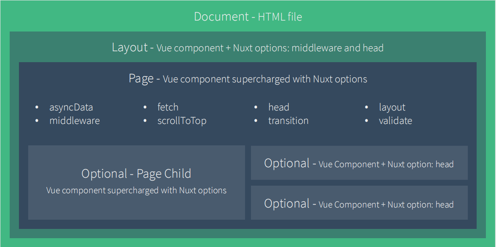
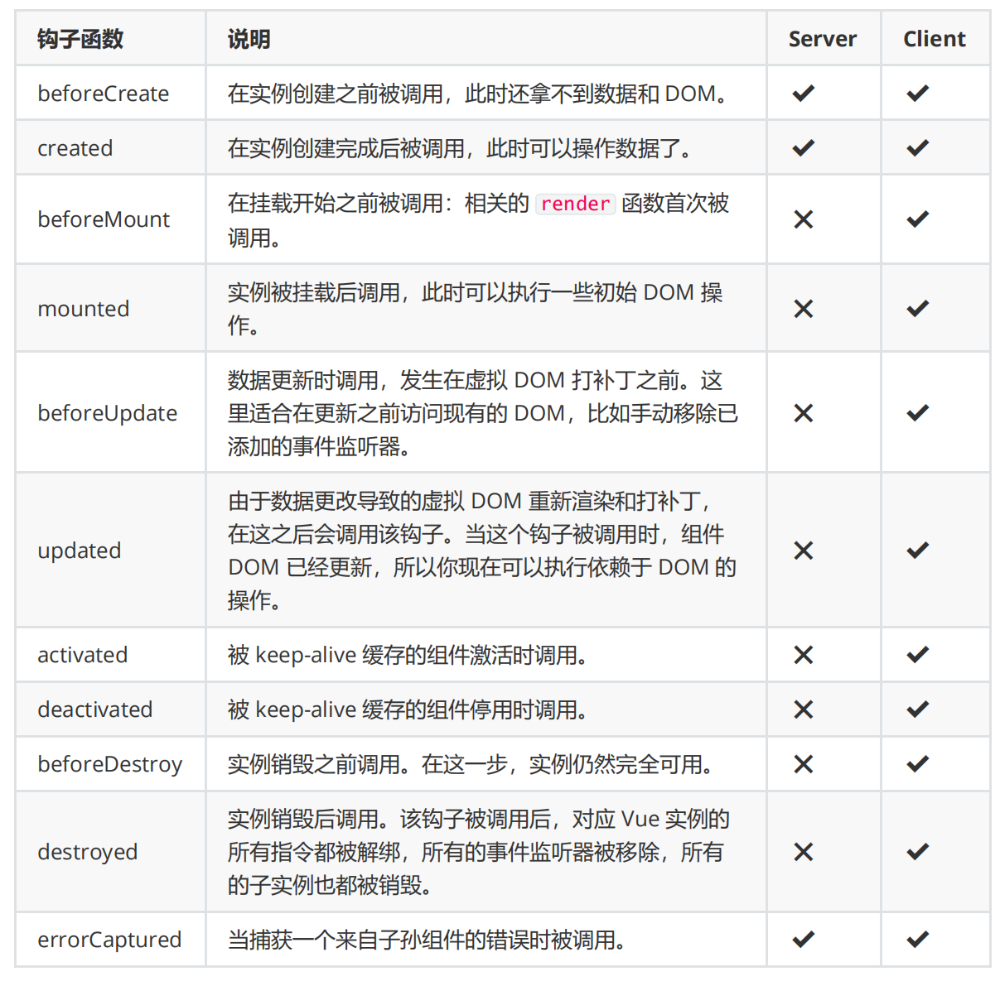
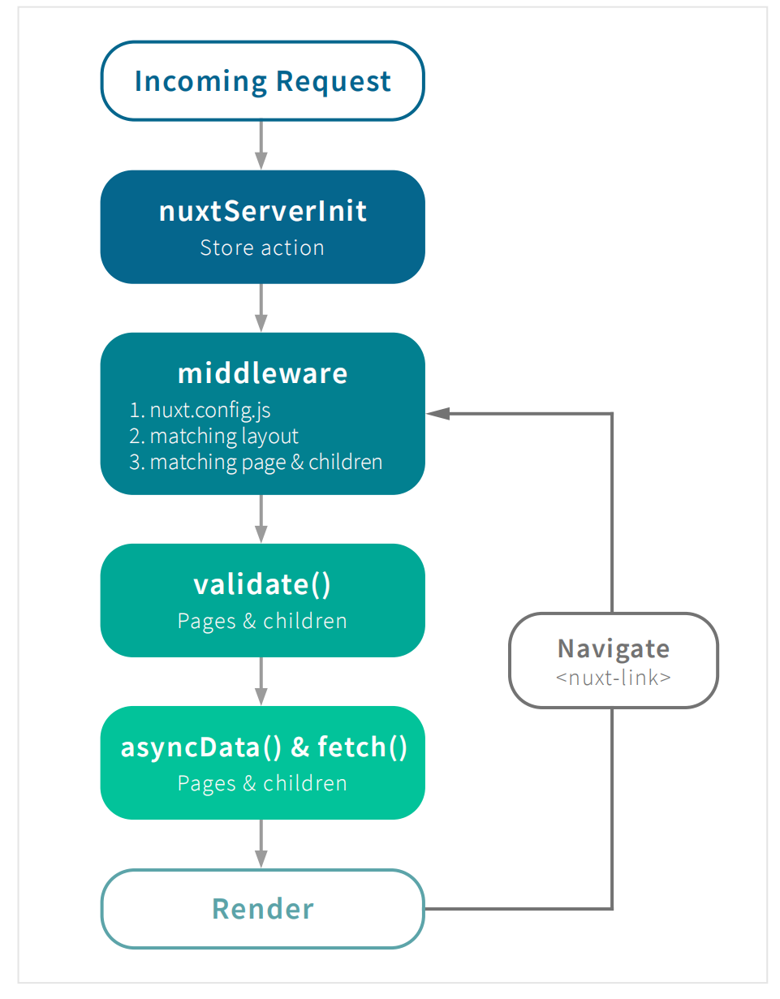

#Nuxt.js 基础

## Nxut.js 介绍

**是什么**

- 官网：https://zh.nuxtjs.org/
- GitHub 仓库: https://github.com/nuxt/nuxt.js

Nuxt.js 是一个基于 Vue.js 的服务端渲染应用框架，他可以帮我们轻松实现同构应用。

通过对客户端/服务端基础架构的抽象组织，Nuxt.js 主要关注的是应用 UI 渲染。

我们的目标是创建一个灵活的应用框架，你可以基于他初始化新项目的基础结构代码，或者在已有 Node.js 项目中使用 Nuxt.js。

Nuxt.js 预设了利用 Vue.js 开发服务器端渲染的应用所需要的各种配置。

除此之外，我们还提供了一种命令叫：`nuxt generate`，为基于 Vue.js 的应用提供生成对应的静态站点的功能。

我们相信这个命令所提供的功能，是向开发集成各种微服务的 Web 应用迈开的新一步。

作为框架，Nuxt.js 为 `客户端/服务端`这种典型的应用架构模式提供了许多有用的特性，例如异步数据加载，中间件支持、布局支持等非常实用的功能。

**特性**

- 基于 Vue.js

  - Vue、Vue Router、Vuex、Vue SSR

- 自动代码分层
- 服务端渲染
- 强大的路由功能，支持异步数据
- 静态文件服务
- ES2015+ 语法支持
- 打包和压缩 JS 和 CSS
- HTML 头部标签管理
- 本地开发支持热加载
- 集成 ESLint
- 支持各种样式预处理器：SASS、LESS、Stylus 等等
- 支持 HTTP/2 推送

**Nuxt.js 框架是如何运作的**

Nuxt.js 集成了以下组件/框架，用于开发完整而强大的 Web 应用：

- Vue.js
- Vue Router
- Vuex
- Vue Server Renderer

压缩并 gzip 后，总代码大小为： 57kb （如果使用了 Vuex 特性的话为 60 kb）

另外，Nuxt.js 使用 Webpack 和 vue-loader、babel-loader 来处理代码的自动化构建工作（如打包、代码分层、压缩等等）。

## 创建项目

Nxut 提供了两种方式用来创建项目：

- 使用 create-nuxt-app 脚手架工具
- 手动创建

> 为了让大家有一个更好的学习效果，这里我们建议先通过手动创建的方式来学习 Nuxt，熟悉了 Nuxt 的基本使用之后，我们会在后面的综合案例中学习如何使用 create-nuxt-app 创建项目

（1）准备

```
# 创建示例项目
mkdir nuxt-app-demo

# 进入示例项目目录中
cd nuxt-app-demo

# 初始化 package.json 文件
npm init -y

# 安装 nuxt
npm install nuxt
```

在 `package.json` 文件的 `scripts` 中新增：

```json
"scripts": {
  "dev": "nuxt"
}
```

上面的配置使用我们可以通过运行 `npm run dev` 来运行 `nuxt`。

（2）创建页面并启动项目

创建 `pages` 目录：

```
mkdir pages
```

创建我们的一个页面 pages/index.vue:

```html
<tempale>
  <h1>Hello world!</h1>
</tempate>
```

然后启动项目：

```
npm run dev
```

现在我们应该运行在 http://localhost:3000 上运行。

> 注意：Nuxt.js 会监听 `pages` 目录中的文件更改，因此在添加新页面时无需重新启动应用程序。

（3）Nuxt 中的基础路由

Nuxt.js 会依据 `pages` 目录中的所有 `*.vue` 文件生成应用的路由配置。

假设 `pages` 的目录结构如下：

```
pages/
 --| user/
 -----| index.vue
 -----| one.vue
 --| index.vue

```

那么，Nuxt.js 自动生成的路由配置如下：

```js
router: {
  routes: [
    {
      name: "index",
      path: "/",
      component: "pages/index.vue",
    },
    {
      name: "user",
      path: "/user",
      component: "pages/user/index.vue",
    },
    {
      name: "user-one",
      path: "/user/one",
      component: "pages/user/one.vue",
    },
  ];
}
```

## Nuxt 路由

Nuxt.js 依据 `pages` 目录结构自动生成 vue-router 模块的路由配置

**基础路由**

假设 `pages` 的目录结构如下：

```
pages/
 --| user/
 -----| index.vue
 -----| one.vue
 --| index.vue

```

那么，Nuxt.js 自动生成的路由配置如下：

```js
router: {
  routes: [
    {
      name: "index",
      path: "/",
      component: "pages/index.vue",
    },
    {
      name: "user",
      path: "/user",
      component: "pages/user/index.vue",
    },
    {
      name: "user-one",
      path: "/user/one",
      component: "pages/user/one.vue",
    },
  ];
}
```

**路由导航**

- a 标签
- `<nuxt-link>`组件
- 编程式导航

**动态路由**

在 Nuxt.js 里面定义带参数的动态路由，需要创建对应的以下划线作为前缀的 Vue 文件或目录。

以下目录结构：

```
pages/
--| _slug/
-----| comments.vue
-----| index.vue
--| users/
-----| _id.vue
--| index.vue
```

Nuxt.js 生成对应的路由配置表为：

```js
router: {
  routes: [
    {
      name: "index",
      path: "/",
      component: "pages/index.vue",
    },
    {
      name: "users-id",
      path: "/users/:id?",
      component: "pages/users/_id.vue",
    },
    {
      name: "slug",
      path: "/:slug",
      component: "pages/_slug/index.vue",
    },
    {
      name: "slug-comments",
      path: "/:slug/comments",
      component: "pages/_slug/comments.vue",
    },
  ];
}
```

你会发现名称为 `users-id` 的路由路径带有 `:id?`参数，表示该路由是可选的。如果你想将它设置为必选的路由，需要在`users/_id` 目录内创建一个`index.vue`文件。

**嵌套路由**

你可以通过 vue-router 的子路由创建 Nuxt.js 应用的嵌套路由。

创建内嵌子路由，你需要添加一个 Vue 文件，同时添加一个与该文件同名的目录用来存放子视图组件。

> Warning:别忘了父组件(`.vue`文件)内增加`<nuxt-child/>`用于显示子视图内容

假设文件结构如：

```
pages/
--| users/
-----| _id.vue
-----| index.vue
--| users.vue
```

Nuxt.js 自动生成的路由配置如下：

```js
route: {
  reoutes: [
    {
      path: "/users",
      component: "pages/uses.vue",
      children: [
        {
          path: "",
          component: "pages/users/index.vue",
          name: "users",
        },
        {
          path: ":id",
          component: "pages/users/_id.vue",
          name: "users-id",
        },
      ],
    },
  ];
}
```

**路由配置**

- https://zh.nuxtjs.org/api/configuration-router

## 视图



**模板**

**布局**

（1）默认布局
（2）自定义布局
（3）错误页码

**页面**

**HTML 页面头部**

（1）默认 Meta 标签
（2）个性化特定页面的 Meta 标签

##异步数据

**asyncData 方法**

Nuxt.js 扩展了 Vue.js，增加了一个叫 asyncData 的方法，使得我们可以在设置组件的数据之前能异步获取或处理数据。

**上下文对象**

**错误处理**

## 生命周期



##插件

##模块

##Vuex 状态管理

下图阐述了 Nuxt.js 应用一个完整的服务器请求到渲染（或用户通过`<nuxt-link>`切换路由渲染页面）的流程


https://zh.nuxtjs.org/examples
##Nuxt 常见问题

- https://zh.nuxtjs.org/faq/

##Nuxt 官方示例

- https://zh.nuxtjs.org/examples
